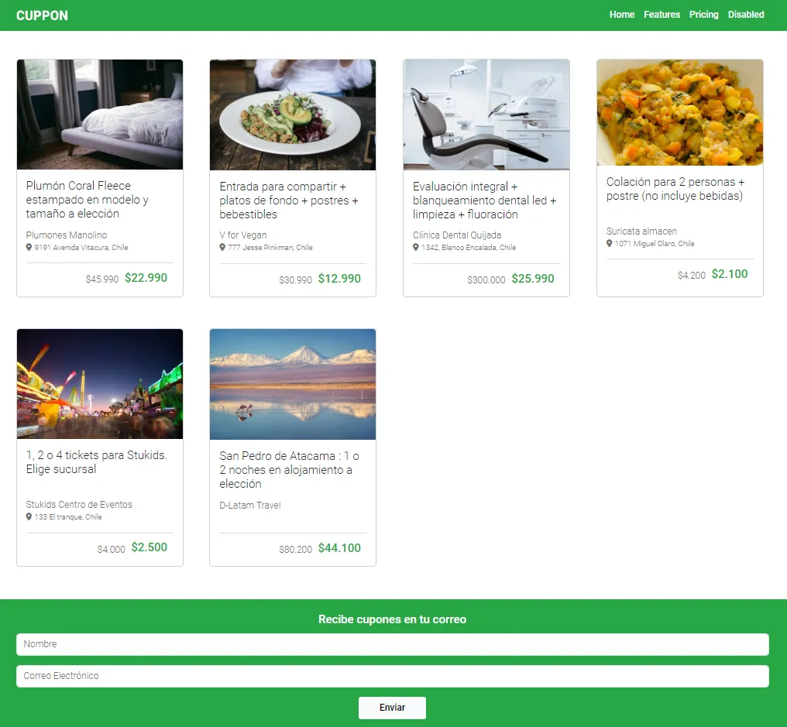
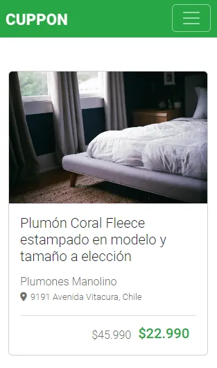

# Cuppon - Plataforma de Ofertas

Cuppon es una plataforma en línea que ofrece descuentos y ofertas en una variedad de productos y servicios. Permite a los usuarios encontrar y aprovechar ofertas exclusivas en restaurantes, actividades de ocio, productos de consumo y más. Esta es una página demo web que utiliza HTML, CSS (Sass), Bootstrap y Font Awesome.

## Demo
Puedes ver la página en vivo aquí: [Landing Cuppon](https://github.com/mr-gantiva/landing_cuppon/)

## Tecnologías Utilizadas

- HTML
- CSS (Sass)
- Bootstrap (v5.3.2)
- Font Awesome (v6)

## Instalación

1. Clona este repositorio.
2. Abre el archivo `index.html` en tu navegador web.

## Uso

- Explora las ofertas disponibles en la plataforma.
- Encuentra información detallada sobre cada oferta, incluyendo el título, el proveedor y la ubicación.
- Compara los precios base y los precios de oferta.
- Regístrate para recibir ofertas en tu correo electrónico.

## Personalización

Los usuarios pueden personalizar la plataforma de acuerdo a sus preferencias. Pueden configurar notificaciones y preferencias de búsqueda.

## Contribución

Si deseas contribuir a este proyecto, sigue estos pasos:

1. Haz un fork del repositorio.
2. Clona tu fork a tu máquina local.
3. Crea una nueva rama para tu función: `git checkout -b nombre-de-la-rama`.
4. Realiza los cambios necesarios y haz commit: `git commit -m 'Descripción de los cambios'`.
5. Empuja tus cambios a tu repositorio en GitHub: `git push origin nombre-de-la-rama`.
6. Crea un pull request en el repositorio original.

## Créditos

- Desarrollado por Ivan Vargas Gantiva

## Licencia

Este proyecto está bajo la Licencia MIT. Consulta el archivo `LICENSE.md` para obtener más detalles.

## Contacto

Si tienes alguna pregunta o comentario, no dudes en ponerte en contacto conmigo en https://github.com/mr-gantiva.

---

© 2023 mr-gantiva